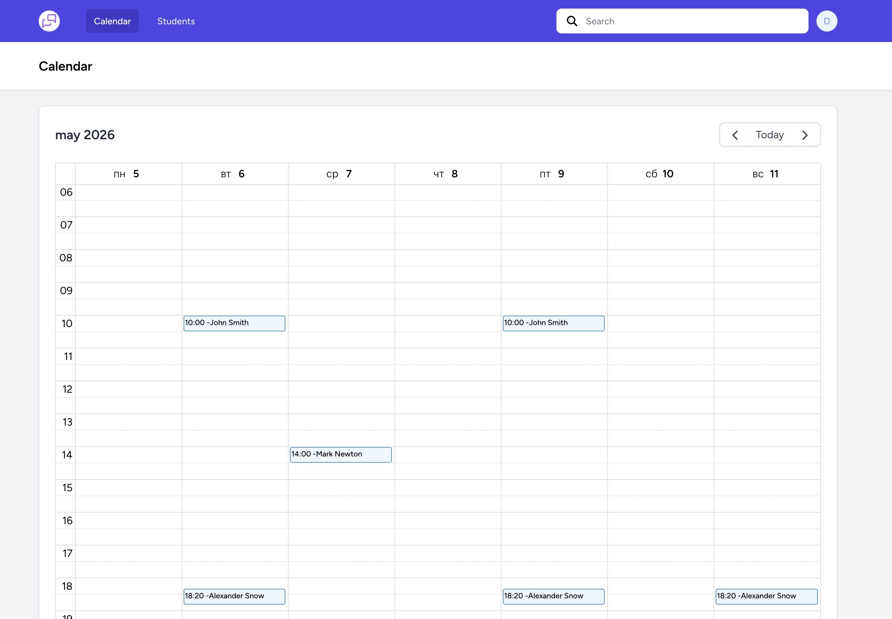

# Logopedics CRM

<p align="center">
  
</p>

<p align="center">
  <a href="https://github.com/Armagnac1/logopedics/actions/workflows/laravel.yml">
    
  </a>
  <a href="#"></a>
  <a href="#"></a>
  <a href="#"></a>
  <a href="#"></a>
</p>

<p align="center">
    
</p>

## 📝 Overview

**Logopedics CRM** is a comprehensive platform designed to streamline speech therapy for children. It helps tutors manage sessions and patient records efficiently while leveraging AI-driven recommendations to deliver personalized learning materials for optimal therapy outcomes.


## 🛠️ Tech Stack

### Backend
- **Framework**: Laravel 10.x
- **PHP Version**: 8.1+
- **Database**: MySQL 8.0+
- **Cache**: Redis
- **Queue**: Laravel Queue with Redis
- **Search**: Laravel Scout with Meilisearch

### Frontend
- **Framework**: Vue 3.x with Composition API
- **Build Tool**: Vite
- **State Management**: Pinia
- **UI Framework**: Tailwind CSS

### DevOps & Tools
- **Containerization**: Laravel Sail (Docker)
- **CI/CD**: GitHub Actions
- **Testing**: PHPUnit, Pest
- **Code Quality**: PHPStan, Laravel Pint
- **Documentation**: Laravel Scribe

### Key Packages
- **Authentication**: Laravel Fortify
- **Authorization**: Spatie Permission
- **Media Handling**: Spatie Media Library
- **API Documentation**: Laravel Scribe
- **Validation**: Laravel Form Request
- **Notifications**: Laravel Notifications

## 🚀 Getting Started

### Prerequisites

- Docker and Docker Compose
- PHP 8.1 or higher
- Composer 2.x
- Node.js 16+ and NPM 8+
- Git

### Installation

1. **Clone the repository**
   ```bash
   git clone https://github.com/Armagnac1/logopedics.git
   cd logopedics
   ```

2. **Install PHP dependencies**
   ```bash
   composer install
   ```

3. **Install Laravel Sail**
   ```bash
   composer require laravel/sail --dev
   php artisan sail:install
   ```

4. **Start the containers**
   ```bash
   ./vendor/bin/sail up -d
   ```

5. **Install frontend dependencies**
   ```bash
   npm install
   ```

6. **Set up environment**
   ```bash
   cp .env.example .env
   ./vendor/bin/sail artisan key:generate
   ```

7. **Configure environment variables**
   ```bash
   # Edit .env file with your specific configurations
   # Required variables:
   # - Database credentials
   # - Mail settings
   # - Redis configuration
   # - Application URL
   ```

8. **Run migrations and seeders**
   ```bash
   ./vendor/bin/sail artisan migrate --seed
   ```

9. **Start development servers**
   ```bash
   # Terminal 1 - Backend
   ./vendor/bin/sail artisan serve
   
   # Terminal 2 - Frontend
   npm run dev
   ```

10. **Access the application**
    - Frontend: `http://localhost`

## 🧪 Testing

```bash
# Run all tests
./vendor/bin/sail artisan test

# Run specific test suite
./vendor/bin/sail artisan test --testsuite=Feature
./vendor/bin/sail artisan test --testsuite=Unit

# Run tests with coverage
./vendor/bin/sail artisan test --coverage

# Run specific test file
./vendor/bin/sail artisan test --filter=TestName
```

## 📁 Key Directories Explained

```
├── app/
│   ├── Actions/            # Single-responsibility business logic
│   ├── Services/           # Business logic services
│   │   ├── Domain/         # Domain-specific services
│   │   └── CrossDomain/    # Cross-domain services
│   └── Repositories/       # Data access layer
│       ├── Contracts/      # Repository interfaces
│       ├── Eloquent/       # Eloquent implementations
│       └── Cached/         # Cache implementations
├── resources/
│   └── js/                 # Vue.js application
│       ├── Components/     # Reusable Vue components
│       ├── Layouts/        # Page layouts
│       ├── Pages/          # Page components
│       └── Types/          # Typescript types
└── lang/                   # Language files
    ├── en/                # English translations
    └── ru/                # Russian translations
```

## 📄 License

All Rights Reserved.

This software is proprietary and confidential. No copying, modification, distribution, or any other use is permitted without explicit written permission from the author.

## 📬 Contact

For questions or support:
- Open an issue in the repository
- Contact Dmitrii Sorokin at [crack7747@gmail.com](mailto:crack7747@gmail.com)

## 🙏 Acknowledgments

- Laravel team for the amazing framework
- Vue.js team for the progressive JavaScript framework
