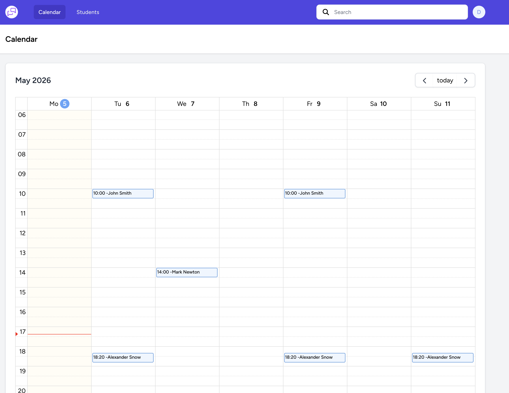

<p align="center">
  
</p>

<h1 align="center">Logopedics CRM</h1>

<p align="center">
  <a href="https://github.com/Armagnac1/logopedics/actions/workflows/laravel.yml">
    
  </a>
  <a href="#"></a>
</p>


<p align="center">
    
</p>


**Logopedics CRM** is a platform designed to streamline speech therapy for children, helping tutors manage sessions and
patient records. With AI-driven recommendations, it delivers personalized learning materials to optimize therapy
outcomes. Built with Laravel and Vue, and containerized with Laravel Sail, it offers a secure, scalable, and
user-friendly solution for modern therapy practices.

---

### ✅ Test Coverage & CI

Automated tests are executed via GitHub Actions on every pull request. Test coverage is monitored to maintain high code
quality and reliability.

---

## 🚀 Quick Start

### Installation Steps

To install this project, follow these steps:

1. **Clone the repo**
   ```bash
   git clone https://github.com/Armagnac1/logopedics.git && cd logopedics
   ```

2. **Install Laravel Sail:**
   ```bash
   composer require laravel/sail --dev
   php artisan sail:install
   ```


3. **Start the containers:**
   ```bash
   ./vendor/bin/sail up -d
   ```

4. **Run frontend dev server:**
   ```bash
   npm i
   npm run dev
   ```

5. **Access the application at `http://localhost`**

---

### 🗃️ Database Setup

Run migrations:

   ```bash
   ./vendor/bin/sail artisan migrate
   ./vendor/bin/sail artisan db:seed
   ```

---

## 📄 License

All Rights Reserved.

This software is proprietary and confidential. No copying, modification, distribution, or any other use is permitted
without explicit written permission from the author.
---

## 📬 Contact

For questions or support, please open an issue or contact Dmitrii Sorokin
at [crack7747@gmail.com](mailto:crack7747@gmail.com)
